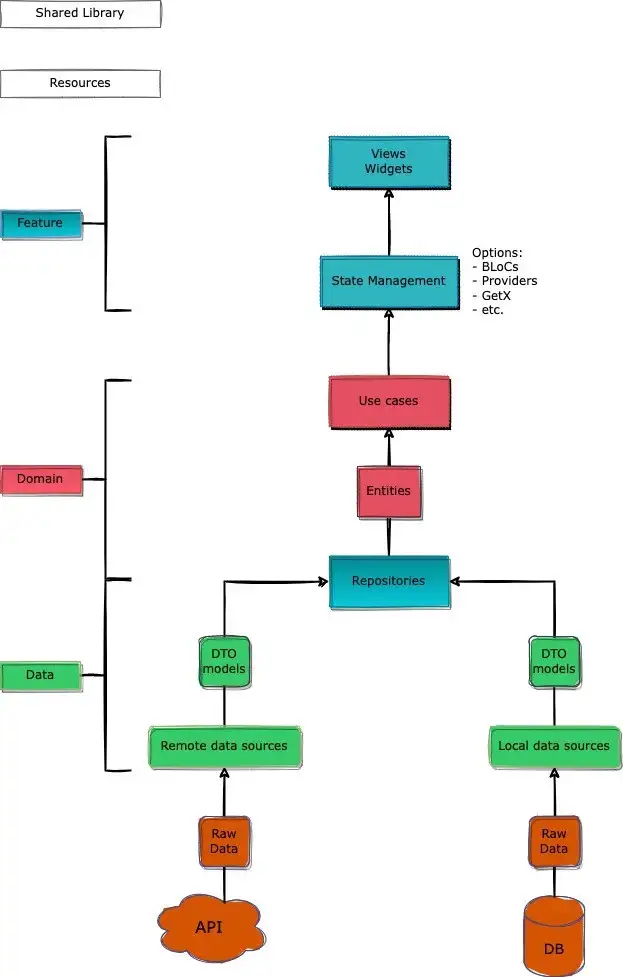

# 포스팅 클론
https://medium.com/ruangguru/an-introduction-to-flutter-clean-architecture-ae00154001b0

## 계층 설명
  
`flutter 다이어그램`
### Feature Layer
이거를 책에서는 Presentation Layer라고 불렀던 부분이다.  
Presentation Layer는 쉽게 보자면 받아먹기만 하는 존재이다.  
업무 규칙에 의존적이며 한편으로는 Flutter Framework에 의존적이다.  
이쪽 레이어는 UI와 이벤트 핸들러 뷰모델 등이 위치하게 될것이다.  

### Domain Layer
그림으로만 보면 도메인 계층은 데이터에 이은 두번째 처럼 보이지만 업무 규칙을 담은 가장 중요하고 안쪽의 계층이다.  
이 계층은 가장 최고이므로 의존하는게 아닌 누군가가 의존하는 형태가 될것이다.  
업무 규칙은 당연히 의존성없이 동작해야하므로 Flutter 프레임 워크를 사용하지 않고 순수하게 Dart로만 작성될 것이다.
- Use Case: 각 운영 시스템 별 업무 규칙
```
클린 아키텍처에서는 주문 관리 시스템에서 주문 생성, 주문 삭제 두가지를 분리하여 유즈케이스로 만드는 예로 들어 설명했다.
```
- Entity: 각 운영 시스템 별 업무 개체
```
이 지점이 최고로 의존되는 부분이 될것이며 바뀌면 아래로 의존성 역전이 안된 부분들까지 싹다 바뀌게 될것이다.
```
- Repository: 도메인과 외부 계층의 예상 기능을 정의하는 추상 클래스
```
이거를 Gateway라고도 표현하던데 Domain과 Data 계층 간의 교환 등을 하는 부분이다.  
쉽게 말하면 외부 데이터 소스에서 데이터를 가져오는데 이미 위에 설명했듯 업무 규칙이 있는 도메인 계층과 데이터 계층은 서로 분리 되어야하며 도메인 계층이 데이터에 의존하면 안되므로 추상클래스를 사용하여 의존성 역전으로 데이터 계층이 업무 규칙이 담긴 도메인 계층을 의존하게 만드는 것이다.
```
### Data Layer
데이터가 있을 레이어이다. 여기에는 DTO 모델과 각 모델이 접속할 데이터 소스가 있다.  
- Repository: 도메인 계층의 추상 클래스 Repository를 실제로 구현하는 부분 데이터 원본을 조정해야한다.
- DTO Models: 데이터 원본과 상호작용할 수 있는 JSON 구조의 표현
- Remote/Local Data Source: 원격이나 로컬 데이터로 구성하여 API를 통해 원격서버를 접속하거나 로컬 데이터를 캐시하거나 유지한다.
- Mapper: 도메인 계층의 모델을 매핑하거나 그 반대를 한다.

### Shared Library/Resources
다른 모든 레이어에서 접근할 수 있다.
```
그런데 웬만하면 안쓰는게 제일 좋을 거 같다. 결국 신경써야할 의존성이 하나 더 는다는 얘기 아닐까.
```

## 코드
### 구조
```
Application
- core
  - user
    - data
      - dto
        - user_dto.dart
        - user_response_dto.dart
      - datasource
        - user_remote_datasource.dart
        - user_local_datasource.dart
      - mapper
        - user_mapper.dart
      - repository
        - user_repository.dart
      - di
        - dependency.dart
    - domain
      - repository
        - user_repository_impl.dart
      - entity
        - user_entity.dart
      - usecase
        - get_user_list_usecase.dart
        - get_user_detail_usecase.dart
      - di
        - dependency.dart
- feature
  - user
    - page
      - user_list_page.dart
      - user_details_page.dart
    - controller
      - user_list_controller.dart
      - user_details_controller.dart
    - widget
      - user_card_widget.dart
```
이 예제에서는 도메인과 데이터 계층을 분리하지 않고 Core라는 하나의 폴더로 묶었다.

### Data
데이터 계층의 역할은 로컬 소스(로컬 DB, Shared Preferences)나 일반적으로 JSON 형식을 사용하는 원격 소스(원격 API)같이 다른 데이터 소스에서 원본 데이터를 직접적으로 처리한다.  
작성자는 데이터 소스와 상호작용할 수 있게 user_dto.dart를 JSON 구조로 매핑할 수 있게 만들었다.  
user_remote_datesource.dart는 원격 소스 이며 API위에서 HTTP 요청을 수행한다.
(여기 강조표시가 뭉개져서 문장 순서가 뒤죽박죽이다. 임의 해석)

user_repository_impl.dart는 도메인 계층의 repository 추상 클래스를 실제로 구현해야하므로 도메인 계층에서 추상 클래스를 구현한 다음에 데이터 계층에서 구체 클래스를 구현해야한다.  
이렇게 하면 도메인 계층과 상호작용하지 않고 데이터 계층에서 여러 구현이나 변경 사항을 실시할 수 있다.

Mapper는 API(여기서는 DTO)에서 가져온 데이터를 업무 개체에 매핑하는 간단한 클래스이다.

```dart
user_dto.dart

class UserDTO {
  UserDTO({
    this.id
    this.email,
    this.firstName,
    this.lastName,
    this.occupation,
  });

  int id;
  String? email;
  String? firstName;
  String? lastName;
  String? occupation;

  factory UserDTO.fromJson(Map<String, dynamic> json) => UserDTO(
    id: json["id"],
    email: json["email"],
    firstName: json["first_name"],
    lastName: json["last_name"],
    occupation: json["occupation"],
  );

  Map<String, dynamic> toJson() => {
    "id": id,
    "email": email,
    "first_name": firstName,
    "last_name": lastName,
    "occupation": occupation,
  };
}
```

```dart
user_remote_data_source.dart

class UserRemoteDataSource {
  final HttpHandler httpHandler;

  const UserRemoteDataSource({required this.httpHandler});

  Future<UserDTO> getUserDetails(String userId) async {
    final String url =
        HttpRequestUrl.create(Constants.endpoint.userDetails);

    final Map<String, dynamic> params = {
      "user_id": userId,
    };

    try {
      final response = await httpHandler.get(
        url: url,
        queryParameters: params,
      );
      return UserDto.fromJson(response);
    } catch (e) {
      rethrow;
    }
  }
  
  Future<List<UserDTO>> getUserList({required String companyId}) {
    // TODO: implement getUserList
    throw UnimplementedError();
  }
}
```

```dart
user_repository_impl.dart

class UserRepositoryImpl extends UserRepository {
  late UserRemoteDataSource _remoteDataSource;

  UserRepositoryImpl({
    required UserRemoteDataSource userRemoteDataSource,
  }) {
    _remoteDataSource = userRemoteDataSource;
  }

  @override
  Future<Either<Failure, UserEntity>> getUserDetails({
    required String userId,
  }) async {
    try {
      UserDTO userDto =
          await _remoteDataSource.getUserDetails(
        userId,
      );

      UserEntity result =
          mapper.mapDTOtoEntity(userDto);

      return Right(result);
    } on Exception catch (e) {
      rethrow;
    }
  }
}
```

### Domain
도메인이 아키텍처에서 가장 안에 있다는 점은 도메인에 있는 개체들은 완전히 그 어떤 계층의 외부사항의 변경과 독립되어 있다는 의미이다.  
반대로 Feature(Presentation)과 Data 계층은 모두 이 계층에 종속되는데 그 이유는 Data 계층은 여기에 작성된 업무 규칙과 같은 것들을 모두 구현하며 Feature 계층은 구현과 함께 이 업무 규칙들을 사용하여 삽입된 종속성(위젯에서 데이터를 삽입하여 보여주니까 표현을 이리 한거 같다.)으로 사용하기 떄문이다.

Feature 계층은 DTO가 아닌 엔티티로만 데이터를 가져오므로 각 계층을 개별적으로 그리고 독립적으로 분리한다.

```dart
user_entity.dart

/*
+ 덤
Equatable은 일일이 hashcode과 ==operator에 필드를 추가할 필요 없이 값이 같음 조건을 보장시켜주는 라이브러리
*/
class UserEntity extends Equatable {
  const UserEntity({
    required this.id,
    required this.email,
    required this.firstName,
    required this.lastName,
    required this.occupation,
  });

  final int id;
  final String email;
  final String firstName;
  final String lastName;
  final String occupation;

  String fullName() => firstName + " $lastName";
  
  @override
  List<Object?> get props => [
        id,
        email,
        firstName,
        lastName,
        occupation,
      ];
}
```
```dart
user_details_usecase.dart

class GetUserDetailsUseCase extends UseCase<UserEntity, UserDetailParams> {
  final UserRepository repository;

  const GetUserDetailsUseCase({required this.repository});

  @override
  Future<Either<Failure, UserEntity>> call(UserDetailParams params) {
    return repository.getUserDetails(userId: params.userId);
  }
}
```

### Feature
프레젠테이션은 UI가 이동하는 곳이다.(무슨 의미?)  
사용자는 화면에 무언가를 보여주기 위해서는 위젯이 필요하다.  
이 위젯들은 다양한 상태관리 디자인 패턴을 사용하여 관리된다.  
플러터에는 유저 인터페이스 측면에서 많은 것을 제공한다.  
그러나 코드가 거의 즉시 많이 중첩됨을 알 수 있다.  
대부분의 UI 코드는 논리를 염두하여 분할 되고 구성되어야한다.  

이 계층헤는 두가지의 폴더가 있는데 하나는 Page와 다른 하나는 Widget이다.  
Page라는 용어는 응용 프로그램에서 각 페이지를 보여주는 것이다.  
Widget은 컴포넌트의 집합으로써 카드나 리스트 혹은 데코레이션 박스 등 페이지 자체 일부이다.

이 예제에서 작성자는 GetX를 사용하였다.(나는 Provider를 사용할 것이다.)  
컨트롤러는 우리가 도메인 계층의 유즈케이스에서 데이터를 가져올 수 있으며 업무 규칙을 다루는 부분이다.(얘는 당연히 ChangeNotifier가 될 것이다.)
컨트롤러는 위젯 자체에 접근할 수 없다.(당연히 컨트롤러가 위젯을 접근하면 위젯 -> 컨트롤러 -> 위젯 이라는 의존성 순환에 빠지게된다.)  

컨트롤러는 일회용 인터페이스를 확장하는 추상 클래스인 GetxController 클래스를 확장합니다. GetX는 DisposableInterface를 확장하여 위젯이 탐색 스택에서 제거된 직후 메모리에서 컨트롤러를 삭제하여 메모리 소비를 줄이는 데 도움이 됩니다.

```dart
user_details_controller.dart

class UserDetailsController extends GetxController {
  late GetUserDetailsUsecase _useCase;
  
  Rx<String> fullName = "".obs;
  Rx<String> occupation = "".obs;
  int userId = 1;
  
  UserDetailsController({
    required GetUserDetailsUsecase useCase,
  }) {
    _useCase = useCase;
  }
  
  @override
  void onInit() {
    getUserDetails(userId);

    super.onInit();
  }

  Future<void> getUserDetails(String userId) async {
    final result = await _useCase.call(params);

    result.fold((Failure failure) {
      debugPrint(“Failed to fetch the data“);
    }, (data) {
      fullName.value = data.fullName();
      occupation.value = data.occupation;
    });
  }
}
```

```dart
user_details_page.dart

class UserDetailsPage extends StatelessWidget {
  final UserDetailsController _controller = Get.find<UserDetailsController>();

  @override
  Widget build(BuildContext context) {
    return Scaffold(
      appBar: AppBar(
        title: Text("User Details"),
      ),
      body: SafeArea(
        child: Padding(
          padding: const EdgeInsets.all(8),
          child: Center(
            child: Column(
              crossAxisAlignment: CrossAxisAlignment.start,
              mainAxisAlignment: MainAxisAlignment.start,
              children: <Widget>[
                Text("Hello world!"),
                _buildUserInformationWidget(),
              ],
            ),
          ),
        ),
      ),
    );
  }

  Widget _buildUserInformationWidget() {
    return Container(
      child: Obx(
        () => Column(
          children: <Widget>[
            Text("My name is: ${_controller.fullName.value}"),
            Text("My occupation is: ${_controller.occupation.value}"),
          ],
        ),
      ),
    );
  }
}
```

여기서 부턴 내가 만든 Provider 예제
```dart
user_details_provider.dart

class UserDetailsProvider extends ChangeNotifier {
    late GetUserDetailsUsecase _useCase;
    
    String fullName = "";
    String occupation = "";
    int userId = 1;

    UserDetailsController({
        required GetUserDetailsUsecase useCase,
    }) {
        _useCase = useCase;
    } 

    Future<void> init() async {
        getUserDetails(userId);
    }

    Future<void> getUserDetails(String userId) async {
    final result = await _useCase.call(params);

    result.fold((Failure failure) {
      debugPrint(“Failed to fetch the data“);
    }, (data) {
      fullName.value = data.fullName();
      occupation.value = data.occupation;
    });
  }
}
```

```dart
user_details_page.dart

class UserDetailsPage extends StatelessWidget {
  @override
  Widget build(BuildContext context) {
    return Scaffold(
      appBar: AppBar(
        title: Text("User Details"),
      ),
      body: SafeArea(
        child: Padding(
          padding: const EdgeInsets.all(8),
          child: Center(
            child: Column(
              crossAxisAlignment: CrossAxisAlignment.start,
              mainAxisAlignment: MainAxisAlignment.start,
              children: <Widget>[
                Text("Hello world!"),
                _buildUserInformationWidget(),
              ],
            ),
          ),
        ),
      ),
    );
  }

  Widget _buildUserInformationWidget() {
    return Container(
      child: Obx(
        () => Column(
          children: <Widget>[
            Text("My name is: ${_controller.fullName.value}"),
            Text("My occupation is: ${_controller.occupation.value}"),
          ],
        ),
      ),
    );
  }
}
```

## 결론
훌륭한 아키텍처는 확장 가능하고 유지 관리 가능하고 테스트 가능한 모듈식 응용 프로그램을 만드는데에 중요하다.  
클린 아키텍처는 오늘날 많은 응용 프로그램들의 핵심 아키텍처로 비즈니스 로직을 분리하고 확장할 수 있기 때문이다.  

우리가 사용할 수 있는 아키텍처는 프로젝트 구조에 상당한 영향을 끼칠 수 있다.  
클린 아키텍처를 구현하기 위해서는 많은 코드가 필요하며 그러므로 작은 프로젝트에선 낭비일 수 있다.  
하지만 클린 아키텍처는 복잡함을 줄이며 더 큰 스케일의 프로젝트에서는 필수적이다.  
